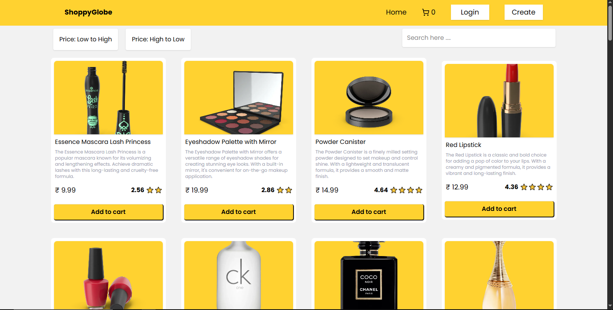
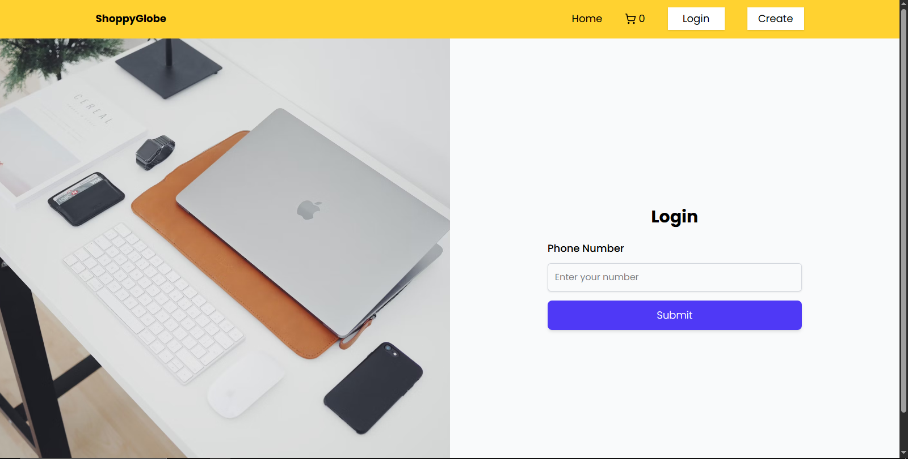
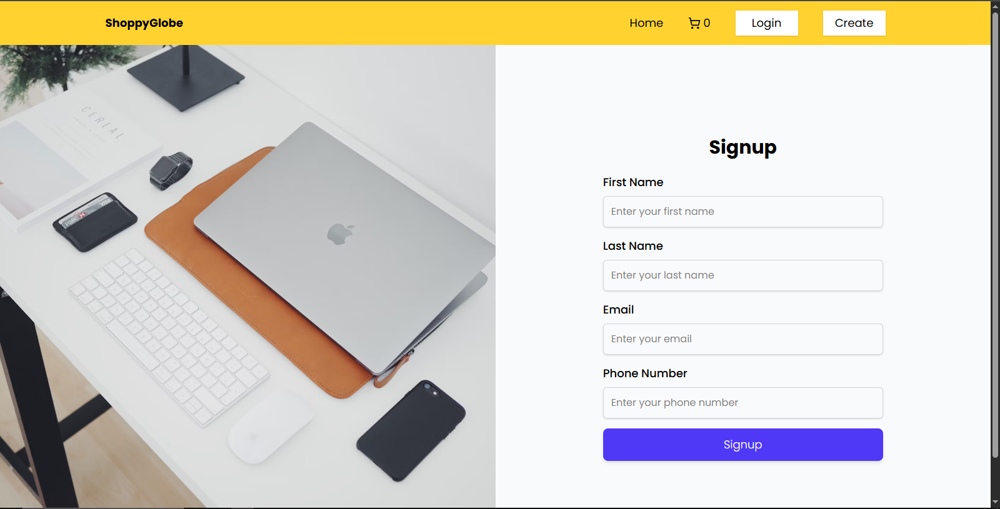
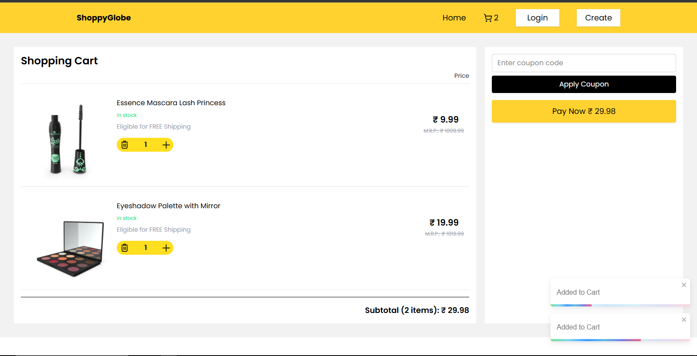
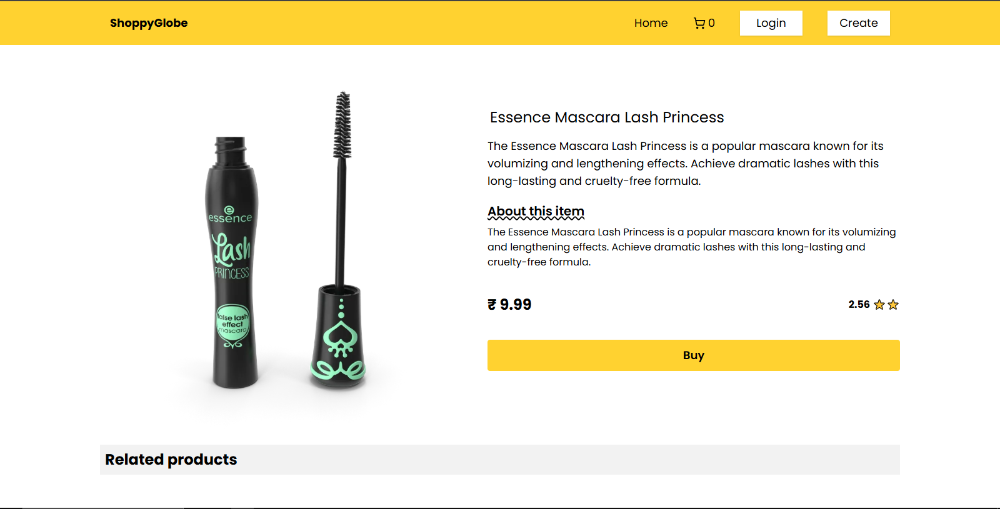

# 🛍️ ShoppyGlobe – E-commerce Web App

**ShoppyGlobe** is a fully responsive e-commerce web application built using **React**, **Redux Toolkit**, **React Router**, and **TailwindCSS**. This application includes features like product listing, detailed product view, cart management, filtering, sorting, authentication UI, and more.

> 🔧 Built from scratch in just **2 days** with complete state and route management, Redux integration, API connection, and mobile responsiveness.

## 🚀 Live Demo

https://www.loom.com/share/cc46d87f1ea14c9e8b06144352fbb3de?sid=2d31b00b-8f20-4a66-bed9-b779601f1735

## 📁 Project Structure

src/
├── app/ # App wrapper and router setup
├── assets/ # Static assets like images and icons
├── components/ # Reusable UI components
├── features/ # Redux Toolkit slices
├── footer/ # Footer component
├── header/ # Header and navbar
├── store/ # Redux store configuration
├── style/ # Global styles
├── main.jsx # App entry point

## 🔗 Pages & Routes

### `/` → **Home Page**
- Displays all products
- Sort by price: Low to High / High to Low
- Search bar for product filtering
- Add to cart button

### `/product/:id` → **Product Detail Page**
- Shows detailed view of a product
- Includes title, image, rating, description, and price
- “Buy” button (non-functional placeholder)
- Shows related products section

### `/products/cart` → **Cart Page**
- Displays items added to cart
- Quantity increment/decrement logic
- Item remove button
- Total price calculation
- Apply coupon UI (non-functional placeholder)
- “Pay Now” button (non-functional placeholder)

### `/login` → **Login Page**
- Phone number input
- Submit button
- (No actual auth logic, just frontend UI)

### `/signup` → **Signup Page**
- First name, last name, email, phone number inputs
- Signup button
- (No actual backend logic, just UI)

---

## 🧠 State Management (Redux Toolkit)

Redux is used to manage the global application state.

### `features/cart/cartSlice.js`
- `addToCart(product)`
- `removeFromCart(productId)`
- `changeQty({ id, qty })`
- `calculateTotalPrice()` via reducer logic
- Prevents duplicate items
- Removes item when quantity hits 0

---

## 🌐 API Integration

- Product data is fetched via REST API (or local JSON/fake store API)
- Single product fetched dynamically using `/product/:id`
- Data loading controlled via Redux state & component logic

---

## 🎨 UI Technologies Used

- **React.js**
- **Redux Toolkit**
- **React Router DOM**
- **TailwindCSS**
- **Vite** (Fast build tool)
- **Toast notifications**

---

## ✅ Features

- ✅ Product listing grid
- ✅ Sort by price (Low → High / High → Low)
- ✅ Product search
- ✅ Detailed product page
- ✅ Add to cart
- ✅ Cart quantity update
- ✅ Remove item from cart
- ✅ Subtotal calculation
- ✅ Basic login/signup form UI
- ✅ Fully responsive layout

---

## 🧩 Future Improvements

- 🔐 Backend authentication (JWT)
- 🛒 Order history and checkout flow
- 📦 Admin panel for managing products
- 🧪 Unit and integration tests (Jest, React Testing Library)
- 📱 PWA support

---

## 👨‍💻 Developer

**Nitin** – Full Stack Developer (MERN)  
8 months experience | Passionate about building real-world apps  
[🔗 LinkedIn](#) | [📂 Portfolio](#) | [📧 Email](#)